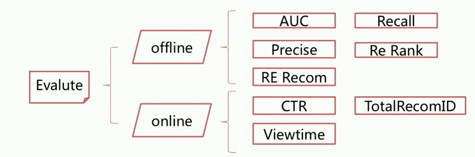
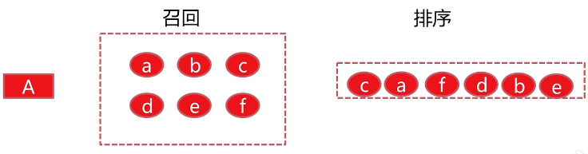

个性化推荐算法实战

1 推荐算法综述
==============

1.1 个性化推荐算法综述
----------------------

环境：python TensorFlow word2vec xgboost

高数微积分、线性代数、概率论相关知识

机器学习基本知识，数据挖掘大体了解

1.2 个性化召回算法综述
----------------------

### 1.2.1 什么是个性化召回

>   根据用户的属性行为上下文等信息从物品全集中选取其感兴趣的物品作为候选集

### 1.2.2 召回在推荐系统中的重要作用

召回决定了最终推荐结果的天花板

### 1.2.3 工业界个性化召回解析

分类

-   基于用户行为的

-   基于user profile的

-   基于隐语义的

工业界个性化召回架构

2 个性化推荐召回算法
====================

2.1 LFM算法综述
---------------

### 2.1.1 个性化召回算法(latent factor model)综述

LFM算法的背景

<https://blog.csdn.net/bbbeoy/article/details/78646576>

应用于计算用户的toplike、计算item的topsim、计算item的topic

### 2.1.2 LFM理论知识与公式推导

LFM建模公式：

$$
p\left( u,i \right) = p_{u}^{T}q_{i} = \sum_{f = 1}^{F}{p_{\text{uf}}q_{\text{if}}}
$$

LFM loss function

$$
loss = \sum_{(u,i) \in D}^{}{(p\left( u,i \right) - p^{\text{LFM}}(u,i))^{2}}
$$

$$
loss = \sum_{(u,i) \in D}^{}{{(p\left( u,i \right) - \sum_{f = 1}^{F}{p_{\text{uf}}q_{\text{if}}})}^{2} + \alpha_{1}\left| p_{u} \right|^{2} + \alpha_{2}\left| q_{i} \right|^{2}}
$$

LFM算法迭代

对上式求偏导：

$$
\frac{\partial\text{loss}}{\partial p_{\text{uf}}} = - 2\left( p\left( u,i \right) - p^{\text{LFM}}\left( u,i \right) \right)q_{\text{if}} + 2\alpha_{1}p_{\text{uf}}
$$

$$
\frac{\partial\text{loss}}{\partial q_{\text{if}}} = - 2\left( p\left( u,i \right) - p^{\text{LFM}}\left( u,i \right) \right)p_{\text{uf}} + 2\alpha_{2}q_{\text{if}}
$$

使用梯度下降算法

$$
p_{\text{uf}} = p_{\text{uf}} - \beta\frac{\partial loss}{\partial p_{\text{uf}}}
$$

$$
q_{\text{if}} = q_{\text{if}} - \beta\frac{\partial loss}{\partial q_{\text{if}}}
$$

参数设定影响效果

-   负样本选取

-   隐特征F（10\~32）、正则参数、learning rate

### 2.1.3 LFM算法和CF算法的优缺点比较

理论基础

离线计算空间时间复杂度

在线推荐与推荐解释

3 personal rank算法
===================

3.1 personal rank算法的背景和物理意义
-------------------------------------

### 3.1.1 背景

用户行为很容易表示为图

图推荐在个性化推荐领域效果显著

### 3.1.2 二分图

二分图又称为二部图，是图论中的一种特殊模型。设G=(V,E)是一个无向图，如果顶点V可分割为两个互不相交的子集(A,B)，并且图中的每条边(i,j)所关联的两个顶点i和j分别属于这两个不同的顶点集(i
in A, j in B)，则称图G为一个二分图。

Example：

对userA来说，item_c和item_e哪个更值得推荐？

### 3.1.3 物理意义

两个顶点之间连通路径数

两个顶点之间连通路径长度

两个顶点之间连通路径经过顶点的出度

Example:

分别由几条路径连通？

连通路径的长度分别是多少？

连通路径经过的顶点的出度分别是多少？

3.2 personal rank算法的数学公式推导
-----------------------------------

### 3.2.1 算法抽象-文字阐述

对用户A进行个性化推荐，从用户A结点开始在用户物品二分图random
walk，以alpha的概率从A的出边中等概率选择一条游走过去，到达该顶点后（举例顶点a），有alpha的概率继续从顶点a的出边中等概率选择一条继续游走到下一个结点，或者（1-alpha）的概率回到起点A，多次迭代。直到各顶点对于用户A的重要度收敛。

### 3.2.2 算法抽象-数学公式

$$
\text{PR}\left( v \right) = \left\{ \begin{matrix}
\alpha*\sum_{\tilde{v \in v}}^{}{\frac{PR(\tilde{v})}{\left| out(\tilde{v}) \right|} (v! = v_{A})} \\
\left( 1 - \alpha \right) + \alpha*\sum_{\tilde{v \in v}}^{}{\frac{PR(\tilde{v})}{\left| out(\tilde{v}) \right|} (v = v_{A})} \\
\end{matrix} \right.\ 
$$

### 3.2.3 算法抽象-矩阵式

$$
r = \left( 1 - \alpha \right)r_{0} + \alpha M^{T}\text{r\ \ \ \ \ \ \ \ \ \ \ \ \ \ \ \ \ \ \ \ \ \ \ \ \ \ \ \ }M_{\text{ij}} = \frac{1}{\left| out(i) \right|}j \in out\left( i \right)else0
$$

$$
\left( E - \alpha M^{T} \right)*r = \left( 1 - \alpha \right)r_{0}
$$

$$
r = \left( E - \alpha M^{T} \right)\left( 1 - \alpha \right)r_{0}
$$

4 item2vec算法
==============

4.1 个性化召回算法Item2vec背景与物理意义
----------------------------------------

### 4.1.1 背景

Item2item的推荐方式效果显著

NN model的特征抽象能力

算法论文：ITEM2VEC: NEURAL ITEM EMBEDDING FOR COLLABORATIVE FILTERING

https://blog.csdn.net/qq_35771020/article/details/89137392

### 4.1.2 物理意义

将用户的行为序列转化成item组成的句子

模仿word2vec训练word embedding将item embedding进行训练

### 4.1.3 缺陷

用户的行为序列时序性缺失

用户行为序列中的item强度是无区分性的

4.2 Item2vec算法应用主流程
--------------------------

从log中抽取用户行为序列

将行为序列当成语料训练word2vec得到item embedding

得到item sim关系用于推荐

Example:

4.3 Item2vec算法依赖model word2vec介绍
--------------------------------------

### 4.3.1 CBOW(continuous bag of words)

### 4.3.2 Skip Gram

### 4.3.3 CBOW Word2vec数学原理

**问题抽象**：

$$
g\left( w \right) = \prod_{u \in w \cup NEG(w)}^{}{p\left( u \middle| \text{Context}\left( w \right) \right)}
$$

$$
p\left( u \middle| \text{Context}\left( w \right) \right) = \sigma(X_{w}^{T}\theta^{u})^{L^{w}\left( u \right)}(1 - \sigma(X_{w}^{T}\theta^{u}))^{({1 - L}^{w}(u))}
$$

Loss Function

$$
Loss = \log{(g(w))}
$$

$$
Loss = \sum_{}^{}{(L^{w}\left( u \right)*\log{\left( \sigma\left( X_{w}^{T}\theta^{u} \right) \right) + \left( 1 - L^{w}\left( u \right) \right)*}\log\left( 1 - \sigma\left( X_{w}^{T}\theta^{u} \right) \right))}
$$

**梯度**：

$$
\frac{\partial\text{Loss}}{\partial\theta^{u}} = \left( L^{w}\left( u \right) - \delta\left( x_{w}^{T}\theta^{u} \right) \right)x_{w}\text{\ \ \ \ \ \ \ \ \ }\theta^{u} = \theta^{u} + \alpha*\frac{\partial Loss}{\partial\theta^{u}}
$$

$$
\frac{\partial\text{Loss}}{\partial x_{w}} = \left( L^{w}\left( u \right) - \delta\left( x_{w}^{T}\theta^{u} \right) \right)\theta^{u}
$$

$$
v\left( w_{\text{context}} \right) = v\left( w_{\text{context}} \right) + \sum_{u \in w \cup NEG(w)}^{}{\alpha*\frac{\partial Loss}{\partial x_{w}}}
$$

**CBOW训练主流程**

-   选取中心词w以及负采样NEG(w)

-   分别获得损失函数对xw与thetau的梯度

-   更新thetau以及中心词对应的context(w)的每一个词的词向量

### 4.3.4 Skip Gram Word2vec数学原理

**问题抽象**

$$
G = \prod_{u \in Context(w)}^{}{\prod_{z \in u \cup NEG\left( u \right)}^{}{p\left( z \middle| w \right)}}
$$

$$
p\left( z \middle| w \right) = (\delta(v\left( w)^{T}\theta^{z} \right))^{L^{u}\left( z \right)}*(1 - \delta(v\left( w)^{T}\theta^{z} \right))^{1 - L^{u}(z)}
$$

Loss Function

$$
Loss = \sum_{u \in Context(w)}^{}{\sum_{z \in u \cup NEG(u)}^{}{L^{u}\left( z \right)*\log{(\delta(v{(w)}^{T}\theta^{z}))}}} + \left( 1 - L^{u}\left( z \right) \right)*\log{(1 - \delta(v{(w)}^{T}\theta^{z}))}
$$

$$
G = \prod_{w^{c} \in context(w)}^{}{\prod_{u \in w \cup NEG(w)}^{}{p(u|w^{c})}}
$$

$$
Loss = \sum_{w^{c} \in Context(w)}^{}{\sum_{u \in w \cup NEG(w)}^{}{L^{w}\left( u \right)*\log{(\delta(v{(w^{c})}^{T}\theta^{u}))}}} + \left( 1 - L^{w}\left( u \right) \right)*\log{(1 - \delta(v{(w^{c})}^{T}\theta^{u}))}
$$

**Skip Gram word2vec训练主流程**

-   对于context(w)中任何一个词wc选取w的正负样本

-   计算Loss对theta以及对wc的偏导

-   更新wc对应的词向量

**负采样算法**

$$
\text{len}\left( \text{word} \right) = \frac{{(counter(word))}^{\alpha}}{\sum_{w \in D}^{}{(counter(word))}^{\alpha}}
$$

5 content based算法
===================

5.1 个性化召回算法Content Based背景介绍
---------------------------------------

思路极简，可解释强

用户推荐的独立性

问世较早，流行度高

5.2 Content Based算法的主体流程介绍
-----------------------------------

### 5.2.1 Item Profile

Topic Finding

Genre Classify

### 5.2.2 User Profile

Genre/Topic

Time Decay

### 5.2.3 Online Recommendation

Find top K Genre/Topic

Get the best n item from fixed Genre/Topic

6 个性化召回算法总结与评估方法的介绍
====================================

6.1 个性化召回算法总结
----------------------

基于领域的

基于内容的

基于neural network的

6.2 个性化召回算法评估
----------------------

离线评价准入

在线评价收益

### 6.2.1 Offline评价方法

评测新增算法推荐结果在测试集上的表现

### 6.2.2 Online评价方法

定义指标

生产环境A/B test

7 排序综述
==========

7.1 什么是learn to Rank？
-------------------------

将个性化召回的物品候选集根据物品本身的属性结合用户的属性，上下文等信息给出展现优先级的过程

7.2 排序在个性化推荐系统中的重要作用
------------------------------------

Rank决定了最终的推荐效果

7.3 工业界推荐系统中排序架构解析
--------------------------------

单一的渐层模型

浅层模型的组合

深度学习模型

8 逻辑回归模型
==============

8.1 逻辑回归(logistic regression, LR)模型的背景知识介绍
-------------------------------------------------------

### 8.1.1 点击率预估与分类模型

<https://www.cnblogs.com/qcloud1001/p/7513982.html>

<https://blog.csdn.net/starzhou/article/details/51769561>

### 8.1.2 什么是LR

<https://blog.csdn.net/weixin_39445556/article/details/83930186>

### 8.1.3 Sigmoid函数

<https://www.jianshu.com/p/d4301dc529d9>

<https://blog.csdn.net/weixin_39445556/article/details/83930186>

Example

LR模型训练流程

-   从Log中获取训练样本与特征

-   Model参数学习

-   Model预测

### 8.1.4 LR Model优点与缺点

优点：易于理解，计算代价小

缺点：容易欠拟合，需要特征工程

8.2 逻辑回归模型的数学原理
--------------------------

### 8.2.1 阶跃函数及其导数

$$
f\left( x \right) = \frac{1}{1 + exp( - x)}
$$

$$
f^{'}\left( x \right) = \frac{exp( - x)}{{(1 + exp( - x))}^{2}}
$$

$$
f^{'}\left( x \right) = \frac{1}{1 + exp( - x)}*\frac{1 + \exp\left( - x \right) - 1}{1 + exp( - x)}
$$

### 8.2.2 LR Model Function

Model function

$$
w = w_{1}*x_{1} + w_{2}*x_{2} + + w_{n}*x_{n}
$$

$$
y = sigmoid(w)
$$

### 8.2.3 Loss Function

$$
loss = \log{\prod_{i = 1}^{n}{p(y_{i}|x_{i})}}
$$

$$
p\left( y_{i} \middle| x_{i} \right) = h_{w}\left( x_{i} \right)^{y_{i}}(1 - h_{w}(x_{i}))^{1 - y_{i}}
$$

$$
loss = - \left( y_{i}\log{h_{w}\left( x_{i} \right)} + \left( 1 - y_{i} \right)\log\left( 1 - h_{w}\left( x_{i} \right) \right) \right)
$$

### 8.2.4 梯度

$$
\frac{\partial\text{loss}}{\partial w_{j}} = \frac{\partial loss}{\partial h_{w}(x_{i})}\frac{\partial h_{w}(x_{i})}{\partial w}\frac{\partial w}{\partial w_{j}}
$$

$$
\frac{\partial loss}{\partial h_{w}(x_{i})} = - (\frac{y_{i}}{h_{w}(x_{i})} + \frac{y_{i} - 1}{{1 - h}_{w}(x_{i})})
$$

$$
\frac{\partial h_{w}\left( x_{i} \right)}{\partial w}\frac{\partial w}{\partial w_{j}} = h_{w}\left( x_{i} \right)\left( 1 - h_{w}\left( x_{i} \right) \right)x_{i}^{j}
$$

梯度下降

$$
\frac{\partial\text{loss}}{\partial w_{j}} = (h_{w}\left( x_{i} \right) - y_{i})x_{i}^{j}
$$

$$
w_{j} = w_{j} - \alpha\frac{\partial loss}{\partial w_{j}}
$$

### 8.2.5 正则化

什么是过拟合

<https://blog.csdn.net/qq_18254385/article/details/78428887>

L1正则化与L2正则化

<https://blog.csdn.net/zhaomengszu/article/details/81537197>

L1：

$$
\text{loss}_{\text{new}} = loss + \alpha\sum_{i = 1}^{n}\left| w_{i} \right|
$$

L2:

$$
\text{loss}_{\text{new}} = loss + \alpha\left| w \right|^{2}
$$

8.3 样本选择与特征选择相关知识
------------------------------

### 8.3.1 Corpus

样本选择规则

样本过滤规则

### 8.3.2 Feature

特征的统计与分析

特征的选择

特征的预处理

9 决策树算法
============

9.1 决策树背景知识介绍
----------------------

### 9.1.1 什么是决策树

决策树(Decision
Tree）是在已知各种情况发生概率的基础上，通过构成决策树来求取净现值的期望值大于等于零的概率，评价项目风险，判断其可行性的决策分析方法，是直观运用概率分析的一种图解法。

<https://www.cnblogs.com/yonghao/p/5061873.html>

### 9.1.2 决策树构造原理

回归树的函数表示

$$
f\left( x \right) = \sum_{m = 1}^{M}{c_{m}I(x \in R_{m})}
$$

$$
\sum_{x_{i} \in R_{m}}^{}{(y_{i} - f(x_{i}))}^{2}
$$

$$
c_{m} = ave(y_{i}|x_{i} \in R_{m})
$$

最优特征选取

$$
\operatorname{}{\lbrack\operatorname{}{\sum_{x_{1} \in R_{1}}^{}{{(y_{i} - C_{1})}^{2} + \operatorname{}{\sum_{x_{1} \in R_{2}}^{}{(y_{i} - C_{2})}^{2}}}}\rbrack}
$$

$$
R_{1} = \left\{ x \middle| x^{j} \leq s \right\},R_{2} = \left\{ x \middle| x^{j} > s \right\}
$$

$$
c_{1} = ave\left( y_{i} \middle| x_{i} \in R_{1} \right),c_{2} = ave\left( y_{i} \middle| x_{i} \in R_{2} \right)
$$

构建树的流程

-   遍历所有特征，特征的最佳划分对应的得分，选取最小得分的特征

-   将数据依据此选取的特征划分分成两部分

-   继续在左右两部分遍历变量找到划分特征直到满足停止条件

**CART生成**

<https://www.jianshu.com/p/b90a9ce05b28>

**回归树：平方误差最小化原则**

**分类树：基尼指数**

基尼指数

$$
\text{Gini}\left( D \right) = 1 - \sum_{k = 1}^{K}\left( \frac{\left| C_{k} \right|}{\left| D \right|} \right)^{2}
$$

$$
D_{1} = \left\{ \left( x,y \right) \in D \middle| A\left( x \right) \geq a \right\},D_{2} = D - D_{1}
$$

$$
\text{Gini}\left( D,A \right) = \frac{\left| D_{1} \right|}{\left| D \right|}\text{Gini}\left( D_{1} \right) + \frac{\left| D_{2} \right|}{\left| D \right|}\text{Gini}\left( D_{2} \right)
$$

9.2 梯度提升树的数学原理与构建方法
----------------------------------

### 9.2.1 什么是boosting

一种用来提高弱分类算法准确度的方法,这种方法通过构造一个预测函数系列,然后以一定的方式将他们组合成一个预测函数

如何改变训练数据的权重

如何组合多个基础model

### 9.2.2 Boosting Tree模型函数

$$
f_{M}\left( x \right) = \sum_{m = 1}^{M}{T(x;\theta_{m})}
$$

$$
f_{m}\left( x \right) = f_{m - 1}\left( x \right) + T(x;\theta_{m})
$$

$$
\theta_{m} = arg\operatorname{}{\sum_{i = 1}^{N}{L\left( y_{i},f_{m - 1}\left( x_{i} \right) + T\left( x_{i},\theta_{m} \right) \right)}}
$$

迭代损失函数

$$
L\left( y,f\left( x \right) \right) = \left( y - f\left( x \right) \right)^{2}
$$

$$
L\left( y,f_{m}\left( x \right) \right) = {\lbrack y - f_{m - 1}\left( x \right) - T(x;\theta_{m})\rbrack}^{2}
$$

### 9.2.3 提升树的算法流程

-   初始化$$f_{0}\left( x \right) = 0$$

-   对m=1,2,3,……计算残差rm，拟合rm，得到Tm

-   更新$$f_{m} = f_{m - 1} + T_{m}$$

Example

### 9.2.4 梯度提升树

残差的数值改变

$$
r_{m} = - {\lbrack\frac{\partial L(y,f(x_{i}))}{\partial f(x_{i})}\rbrack}_{f\left( x \right) = f_{m - 1}(x)}
$$

9.3 XGBoost数学原理与构建方法
-----------------------------

### 9.3.1 XGBoost模型函数

$$
f_{M}\left( x \right) = \sum_{m = 1}^{M}{T\left( x;\theta_{m} \right)}
$$

$$
f_{m}\left( x \right) = f_{m - 1}\left( x \right) + T\left( x;\theta_{m} \right)
$$

$$
\arg\operatorname{}{\sum_{i = 1}^{N}{L\left( y_{i},f_{m - 1}\left( x_{i} \right) + T\left( x_{i};\theta_{m} \right) \right)} + \Omega\left( T_{m} \right)}
$$

### 9.3.2 优化目标的泰勒展开

$$
f\left( x + \Delta x \right) \approx f\left( x \right) + f^{'}\left( x \right)x + \frac{1}{2}f''(x)x^{2}
$$

$$
\operatorname{}{\sum_{i = 1}^{N}{\left\lbrack g_{i}T_{m} + 0.5*h_{i}T_{m}^{2} \right\rbrack + \Omega\left( T_{m} \right)}}
$$

$$
g_{i} = \frac{\partial L\left( y_{i},f_{m - 1} \right)}{\partial f_{m - 1}},h_{i} = \frac{\partial^{2}L\left( y_{i},f_{m - 1} \right)}{\partial f_{m - 1}}
$$

### 9.3.3 定义模型复杂度

$$
f\left( x \right) = \sum_{j = 1}^{Q}{c_{j}I\left( x \in R_{j} \right)}
$$

$$
\Omega\left( T_{m} \right) = \partial Q + 0.5\beta\sum_{j = 1}^{Q}c_{j}^{2}
$$

### 9.3.4 目标转化

$$
\operatorname{}{\sum_{i = 1}^{N}{\left\lbrack g_{i}T_{m} + 0.5*h_{i}T_{m}^{2} \right\rbrack + \Omega\left( T_{m} \right)}}
$$

$$
\operatorname{}{\sum_{i = 1}^{N}{\left\lbrack g_{i}T_{m} + 0.5*h_{i}T_{m}^{2} \right\rbrack + \partial Q + 0.5\beta\sum_{j = 1}^{Q}c_{j}^{2}}}
$$

$$
\operatorname{}{\sum_{j = 1}^{Q}{\left\lbrack \left( \sum_{i \in R_{j}}^{}g_{i} \right)c_{j} + 0.5\left( \sum_{i \in R_{j}}^{}{h_{i} + \beta} \right)c_{j}^{2} \right\rbrack + \partial Q}}
$$

### 9.3.5 目标函数最优解

$$
G_{j} = \sum_{i \in R_{j}}^{}{g_{i},H_{j} = \sum_{i \in R_{j}}^{}h_{i}}
$$

$$
\operatorname{}{\sum_{j = 1}^{Q}{{\lbrack G}_{j}c_{j} + 0.5(H_{j} + \beta)c_{j}^{2}\rbrack}} + \partial Q
$$

$$
c_{j} = - \frac{G_{j}}{H_{j} + \beta},obj = - 0.5\sum_{i = 1}^{Q}{\frac{G_{j}^{2}}{H_{j} + \beta} + \partial Q}
$$

### 9.3.6 最佳划分特征选取

$$
c_{j} = - \frac{G_{j}}{H_{j} + \beta},obj = - 0.5\sum_{i = 1}^{Q}{\frac{G_{j}^{2}}{H_{j} + \beta} + \partial Q}
$$

$$
G_{\text{ain}} = \left( \frac{G_{L}^{2}}{H_{L} + \beta} + \frac{G_{R}^{2}}{H_{R} + \beta} - \frac{{(G_{R} + G_{L})}^{2}}{H_{R} + H_{L} + \beta} \right) - \partial
$$

### 9.3.7 XGBoost总流程

-   初始化$$f_{0}\left( x \right) = 0$$

-   对m=1,2,3,……M应用选择最优划分特征的方法构造树

-   更新$$f_{m} = f_{m - 1} + learning\_ rate + T_{m}$$

9.4 gbdt与lr混合模型网络介绍
----------------------------

### 9.4.1 背景知识

Practical Lessons from Predicting Clicks on Ads at Facebook

逻辑回归需要繁琐的特征处理

树模型的feature transform能力

### 9.4.2 模型网络

### 9.4.3 优缺点总结

优点：利用树模型做特征转化

缺点：两个模型单独训练不是联合训练

10 深度学习
===========

10.1 深度学习背景介绍
---------------------

### 10.1.1 神经元

### 10.1.2 激活函数

sigmoid

tanh

relu

### 10.1.3 神经网络

### 10.1.4 DL & ML difference

10.2 DNN网络结构与数学原理
--------------------------

### 10.2.1 DNN网络结构

### 10.2.2 DNN模型参数

隐层层数，每个隐层神经元个数，激活函数

输入输出层向量维度

不同层之间神经元的连接权重W和偏移值B

10.2.3 前向传播

节点的输出值

$$
a_{j}^{t} = f(\sum_{k}^{}w_{\text{jk}}^{t}a_{k}^{t - 1} + b_{j}^{t})
$$

$$
z_{j}^{t} = \sum_{k}^{}w_{\text{jk}}^{t}a_{k}^{t - 1} + b_{j}^{t}
$$

### 10.2.3 反向传播

Our Target

$$
\frac{\partial L}{\partial w_{\text{jk}}^{t}}\text{\ \ \ \ \ \ \ \ \ \ \ \ \ \ \ \ \ \ \ }\frac{\partial L}{\partial b_{j}^{t}}
$$

What we have

$$
\frac{\partial L}{\partial a_{j}^{T}}\text{\ \ \ \ \ \ \ \ \ \ \ \ \ \ \ \ \ \ \ }\frac{\partial L}{\partial z_{j}^{T}}
$$

推导

$$
\frac{\partial L}{\partial b_{j}^{t}} = \frac{\partial L}{\partial z_{j}^{t}}*\frac{\partial z_{j}^{t}}{\partial b_{j}^{t}} = \frac{\partial L}{\partial z_{j}^{t}}\text{\ \ \ \ \ \ \ \ \ \ \ \ \ \ }z_{j}^{t} = \sum_{k}^{}w_{\text{jk}}^{t}a_{k}^{t - 1} + b_{j}^{t}
$$

$$
\frac{\partial L}{\partial w_{\text{jk}}^{t}} = \frac{\partial L}{\partial z_{j}^{t}}*\frac{\partial z_{j}^{t}}{\partial w_{\text{jk}}^{t}} = \frac{\partial L}{\partial z_{j}^{t}}*a_{k}^{t - 1}
$$

核心

$$
\frac{\partial L}{\partial z_{j}^{t - 1}} = \sum_{k}^{}\frac{\partial L}{\partial z_{k}^{t}}\frac{\partial z_{k}^{t}}{\partial z_{j}^{t - 1}}
$$

$$
z_{j}^{t} = \sum_{k}^{}w_{\text{jk}}^{t}a_{k}^{t - 1} + b_{j}^{t}
$$

$$
\frac{{\partial z}_{k}^{t}}{\partial z_{j}^{t - 1}} = \frac{{\partial z}_{k}^{t}}{\partial a_{j}^{t - 1}}\frac{\partial a_{j}^{t - 1}}{\partial z_{j}^{t - 1}} = w_{\text{jk}}^{t}\frac{\partial a_{j}^{t - 1}}{\partial z_{j}^{t - 1}}
$$

-   对输入x，设置合理的输入向量

-   前向传播逐层逐个神经元求解加权和与激活值

-   对于输出层求解输出层损失函数对于z值的偏导

-   反向传播逐层求解损失函数对z值的偏导

-   得到w与b的梯度

10.3 WD(wide and deep)网络结构与数学原理
----------------------------------------

### 10.3.1 w&d的物理意义

论文：wide & deep learning for Recommender Systems

Generalization and Memorization

### 10.3.2 w&d的网络结构

x

模型输出

$$
a_{\text{out}}^{T} = h\left( w_{\text{wide}},w_{\text{deep}} \right) = \sigma(w_{\text{wide}}\left\lbrack x,x_{\text{cross}} \right\rbrack + w_{\text{deep}}a_{\text{out}}^{T - 1} + b^{T})
$$

### 10.3.3 WD model的反向传播

Wide侧参数学习

$$
\frac{\partial L}{\partial w_{\text{widej}}} = \frac{\partial L}{\partial a^{T}}\frac{\partial a^{T}}{\partial z^{T}}\frac{\partial z^{T}}{\partial w_{\text{widej}}} = \frac{\partial L}{\partial a^{T}}\sigma'(z^{T})x_{\text{widej}}
$$

Deep侧参数学习

$$
\frac{\partial L}{\partial z_{j}^{t - 1}} = \sum_{k}^{}\frac{\partial L}{\partial z_{k}^{t}}\frac{\partial z_{k}^{t}}{\partial a_{j}^{t - 1}}\frac{\partial a_{j}^{t - 1}}{\partial z_{j}^{t - 1}} = \sum_{k}^{}\frac{\partial L}{\partial z_{k}^{t}}w_{\text{deepkj}}^{t}\frac{\partial a_{j}^{t - 1}}{\partial z_{j}^{t - 1}}
$$

$$
z_{k}^{t} = \sum_{j}^{}w_{\text{deepkj}}^{t}a_{j}^{t - 1} + b_{k}^{t} \rightarrow t \neq T
$$

$$
z_{k}^{t} = \left( \sum_{j}^{}w_{\text{deepkj}}^{t}a_{j}^{t - 1} + b_{k}^{t} \right) + w_{\text{wide}}*X \rightarrow t = T
$$

$$
\frac{\partial L}{\partial b_{j}^{t}} = \frac{\partial L}{\partial z_{j}^{t}}*\frac{\partial z_{j}^{t}}{\partial b_{j}^{t}} = \frac{\partial L}{\partial z_{j}^{t}}\text{\ \ \ \ \ }\frac{\partial L}{\partial w_{\text{jk}}^{t}} = \frac{\partial L}{\partial z_{j}^{t}}*\frac{\partial z_{j}^{t}}{\partial w_{\text{jk}}^{t}} = \frac{\partial L}{\partial z_{j}^{t}}*a_{k}^{t - 1}
$$

### 10.3.4 server架构

11 学习排序部分总结
===================

11.1 效果回顾
-------------

11.2 离线评估
-------------

Model cv

Model test and data performance

11.3 在线评估
-------------

业务指标

平均点击位置

11.4 特征维度浅析
-----------------

特征维度

User 、Item、Context、UI Relation、Statics Supplement

特征数目

11.5 Rank技术展望
-----------------

多目标学习

强化学习

12 总结
=======

12.1 个性化推荐算法的离线架构
-----------------------------

12.2 个性化推荐算法的在Recall线架构
-----------------------------------

12.3 个性化推荐算法的Rank在线架构
---------------------------------

12.4 个性化推荐算法的回顾
-------------------------

Recall：CF, LFM, Personal Rank, Item2vec, ContentBased

Rank: LR, GBDT, LR + GBDT, WD
